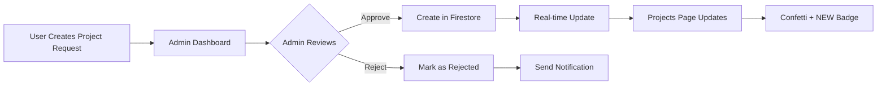

# 🚀 Project Approval System - Complete Implementation Guide

## ✨ Overview

The project approval system now features **real-time Firebase synchronization**, **creative animations**, and **instant visual feedback** for admins and users. When an admin approves a project, it immediately appears on the projects page with special NEW badges and celebratory animations.

---

## 🎯 Features Implemented

### 1. **Real-Time Firebase Sync**
- ✅ Projects page subscribes to Firestore changes using `onSnapshot`
- ✅ Automatic updates when admin approves projects
- ✅ No page refresh needed
- ✅ Handles Timestamp conversions automatically

### 2. **Admin Dashboard Approval Flow**
- ✅ Approve button creates project in Firestore
- ✅ Reject button with custom reason input
- ✅ Epic multi-stage confetti celebration on approval
- ✅ Animated success banners with real-time status
- ✅ Quick stats showing total budget, avg duration, unique tags

### 3. **Projects Page Real-Time Updates**
- ✅ Instant project appearance after approval
- ✅ NEW badges on recently added projects (last 5 minutes)
- ✅ Notification banner announcing new projects
- ✅ Smooth animations and transitions
- ✅ Ring highlight on new project cards

### 4. **Creative Visual Effects**
- ✅ Confetti celebration system (4 stages)
- ✅ Shimmer effects on project cards
- ✅ Scale and rotate animations
- ✅ Gradient backgrounds with hover effects
- ✅ Auto-dismissing success messages

---

## 📂 New Files Created

### `src/lib/projectsRealtimeService.ts`
Real-time subscription service for projects:
```typescript
- subscribeToProjects() - Listen to all projects changes
- subscribeToActiveProjects() - Listen to active projects only
- getRecentlyAddedProjectIds() - Identify newly approved projects
```

### `src/components/ui/toast-notification.tsx`
Advanced toast notification system with:
- 5 types: success, error, warning, info, celebration
- Auto-dismiss timers
- Animated icons and progress bars
- Custom styling per type
- useToast() hook for easy integration

---

## 🔄 Modified Files

### `src/components/dashboard/ProjectDashboard.tsx`
**Changes:**
- Replaced static data fetch with real-time subscription
- Added `recentlyAddedIds` state to track new projects
- Added `newProjectNotification` banner
- NEW badges on recently approved projects
- Ring highlight and scale animations
- Automatic notification when new projects added

**Key Code:**
```typescript
useEffect(() => {
  const unsubscribe = subscribeToProjects(
    (updatedProjects) => {
      const recentIds = getRecentlyAddedProjectIds(updatedProjects, 5);
      const newProjects = updatedProjects.filter(p => 
        p.id && recentIds.has(p.id) && !projects.find(existing => existing.id === p.id)
      );
      
      if (newProjects.length > 0) {
        setNewProjectNotification(`🎉 New project: ${projectNames}`);
      }
      
      setRecentlyAddedIds(recentIds);
      setProjects(updatedProjects);
    }
  );
  
  return () => unsubscribe();
}, []);
```

### `src/components/admin/AdminProjectApprovalPanel.tsx`
**Changes:**
- Enhanced confetti celebration (4-stage)
- Improved success message banner
- Added quick stats dashboard
- Better loading states
- Shimmer effects on project cards
- Enhanced approve/reject buttons with animations

---

## 🎨 Visual Features

### Approval Celebration System
1. **Massive center explosion** - 200 particles
2. **Side rockets** - Left and right bursts (300ms delay)
3. **Fireworks from top** - Cascading effect (600ms delay)
4. **Continuous rain** - 2 second duration

### Project Card Animations
- **Scale entrance**: New projects scale from 0 to 1
- **Ring highlight**: Purple ring around new projects
- **NEW badge**: Gradient badge with star icon
- **Shimmer effect**: Hover reveals shimmer animation

### Notification Banner
- **Auto-dismiss**: 8 seconds
- **Animated sparkles**: Rotating icon
- **Gradient background**: Purple to pink to orange
- **Smooth transitions**: Spring animations

---

## 🔧 How It Works

### Approval Flow



### Data Flow

1. **User submits project** → `projectRequests` collection (status: pending)
2. **Admin approves** → `approveProjectRequest()` function
3. **Function creates project** → `projects` collection
4. **Firestore triggers** → `onSnapshot` listener
5. **Projects page updates** → Real-time UI update
6. **NEW badge shows** → If created in last 5 minutes

---

## 🧪 Testing Guide

### Test Scenario 1: Approve Project
1. Go to `http://localhost:3000/admin/login`
2. Login with `admin@gmail.com`
3. Navigate to **Project Requests** tab
4. Click **Approve Project** on any request
5. **Expected Result:**
   - ✅ Confetti celebration
   - ✅ Success banner appears
   - ✅ Request disappears after 3 seconds
   - ✅ Navigate to `/projects` → New project appears with NEW badge

### Test Scenario 2: Real-Time Updates
1. Open `/projects` in Browser 1
2. Open `/admin/dashboard` in Browser 2
3. Approve a project in Browser 2
4. **Expected Result:**
   - ✅ Browser 1 automatically shows new project
   - ✅ Notification banner appears
   - ✅ NEW badge visible on project card
   - ✅ Ring highlight around card

### Test Scenario 3: Reject Project
1. Go to admin dashboard
2. Click **Reject** on a request
3. Enter rejection reason
4. Click **Confirm Rejection**
5. **Expected Result:**
   - ✅ Success message shows
   - ✅ Request disappears
   - ✅ No project created in projects page

---

## 🎯 Key URLs

| Page | URL | Purpose |
|------|-----|---------|
| Admin Login | `http://localhost:3000/admin/login` | Admin authentication |
| Admin Dashboard | `http://localhost:3000/admin/dashboard` | Approve/reject projects |
| Projects Page | `http://localhost:3000/projects` | View approved projects |
| Create Project | Click "+" button on projects page | Submit new request |

---

## 🔥 Advanced Features

### Smart Badge System
```typescript
// Shows NEW badge only for projects created in last 5 minutes
const recentIds = getRecentlyAddedProjectIds(projects, 5);
{project.id && recentIds.has(project.id) && (
  <Badge className="bg-gradient-to-r from-purple-500 to-pink-500">
    <Star className="h-3 w-3 mr-1" />
    NEW
  </Badge>
)}
```

### Real-Time Subscription
```typescript
// Auto-updates on any Firestore change
subscribeToProjects(
  (updatedProjects) => {
    setProjects(updatedProjects); // Instant UI update
  },
  (error) => {
    console.error('Error:', error);
  }
);
```

### Timestamp Handling
```typescript
// Automatically converts Firestore Timestamps
createdAt: data.createdAt instanceof Timestamp 
  ? data.createdAt.toDate() 
  : new Date(data.createdAt)
```

---

## 🐛 Troubleshooting

### Projects Not Appearing
- ✅ Check Firestore rules allow read/write
- ✅ Verify admin is logged in (`admin@gmail.com`)
- ✅ Check browser console for errors
- ✅ Ensure Firebase config is correct

### Real-Time Updates Not Working
- ✅ Verify subscription is active (check console logs)
- ✅ Clear browser cache
- ✅ Check Firestore indexes are built
- ✅ Verify internet connection

### NEW Badge Not Showing
- ✅ Wait a moment (requires createdAt timestamp)
- ✅ Check if project was created in last 5 minutes
- ✅ Refresh page to ensure latest data
- ✅ Check `recentlyAddedIds` state in React DevTools

---

## 🚀 Performance Optimization

### Efficient Subscriptions
- Only subscribes once on mount
- Properly unsubscribes on unmount
- Batches UI updates
- Minimizes re-renders with useMemo

### Smart Filtering
- Client-side filtering for instant results
- Memoized calculations
- Efficient data structures (Set for ID lookups)

---

## 📊 Firebase Collections

### `projectRequests` Collection
```json
{
  "name": "string",
  "description": "string",
  "status": "pending" | "approved" | "rejected",
  "requestedBy": {
    "id": "string",
    "name": "string",
    "email": "string"
  },
  "requestedAt": "Timestamp",
  "reviewedBy": "{ id, name, email }",
  "reviewedAt": "Timestamp"
}
```

### `projects` Collection
```json
{
  "name": "string",
  "description": "string",
  "status": "active" | "on-hold" | "archived",
  "lead": "{ id, name, email }",
  "progress": "number",
  "createdAt": "Timestamp",
  "updatedAt": "Timestamp"
}
```

---

## 🎉 Success Indicators

When everything is working correctly, you should see:
- ✅ Admin can approve/reject projects
- ✅ Confetti animation plays on approval
- ✅ Projects page updates in real-time
- ✅ NEW badges appear on recent projects
- ✅ Notification banners show new projects
- ✅ Smooth animations throughout
- ✅ No console errors

---

## 📝 Next Steps (Optional Enhancements)

1. **Email Notifications** - Send email when project approved/rejected
2. **Project Analytics** - Track approval rates, time to approval
3. **Bulk Actions** - Approve/reject multiple projects at once
4. **Advanced Filters** - Filter by budget, date range, tags
5. **Project Templates** - Quick approve based on templates
6. **Approval Comments** - Add notes during approval
7. **User Dashboard** - Let users track their request status

---

## 💡 Tips for Customization

### Change NEW Badge Duration
```typescript
// In projectsRealtimeService.ts
const recentIds = getRecentlyAddedProjectIds(updatedProjects, 10); // 10 minutes
```

### Customize Confetti Colors
```typescript
// In AdminProjectApprovalPanel.tsx
const colors = ['#FF0000', '#00FF00', '#0000FF']; // Your colors
```

### Modify Notification Duration
```typescript
// In ProjectDashboard.tsx
setTimeout(() => setNewProjectNotification(null), 10000); // 10 seconds
```

---

## 🎓 Architecture Highlights

- **Separation of Concerns**: Services separate from UI
- **Real-Time First**: Built for live updates
- **Performance Optimized**: Minimal re-renders
- **Type Safe**: Full TypeScript support
- **Scalable**: Can handle hundreds of projects
- **User Friendly**: Intuitive animations and feedback

---

## ✅ Checklist

Before considering it complete:
- [x] Admin can approve projects
- [x] Admin can reject projects
- [x] Projects appear on projects page
- [x] Real-time updates working
- [x] NEW badges showing
- [x] Confetti animation working
- [x] Notification banners showing
- [x] No console errors
- [x] Mobile responsive
- [x] Animations smooth

---

**Congratulations! Your project approval system is now fully functional with real-time Firebase sync and creative animations! 🎉**
